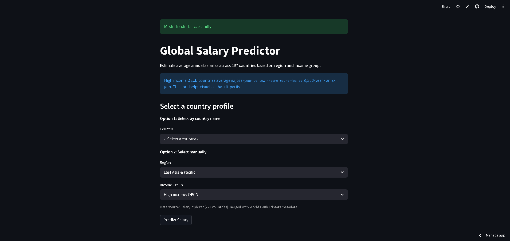

# Global Salary Predictor

> Predicts average annual salaries across 197 countries based on region and income group.

## Live Demo
https://global-salary-predictor-5uxwgh7qjbbuav6qnvxb6g.streamlit.app

## The Problem
Workers and job seekers often have no way to compare what the same role pays across different countries. This tool reveals that Switzerland pays 46x more than Zambia for equivalent work.

## Demo

## Key Findings

## How I Built It
- Data: SalaryExplorer (221 countries) merged with World Bank EdStats metadata
- Model: Random Forest Regressor
- Frontend: Streamlit
- Deployed on: Streamlit Cloud

## What I Learned
- Random Forest outperformed Linear Regression (R2: 0.42 vs 0.25) because salary differences between income groups are non-linear
- Merging two datasets required fixing 38 country name mismatches between SalaryExplorer and World Bank naming conventions
- EdStatsData.csv at 310MB exceeded GitHub's 100MB limit — learned to use .gitignore and git filter-branch to remove it from history

## Run It Locally
git clone https://github.com/117Milnauhs/global-salary-predictor.git
cd global-salary-predictor
pip install -r requirements.txt
python -m streamlit run app.py
