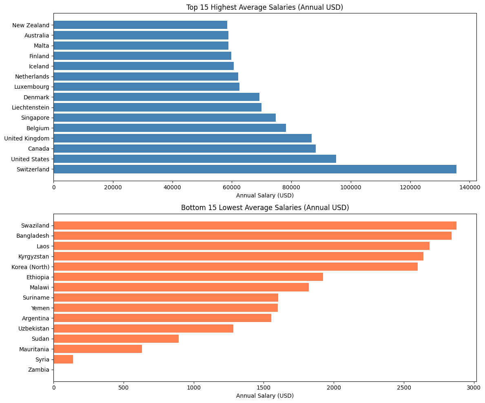
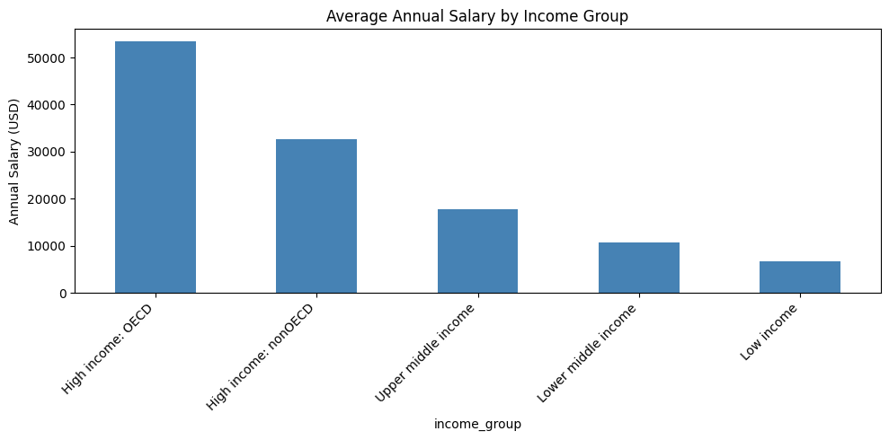

# Global Salary Predictor

> Predicts average annual salaries across 197 countries based on region and income group.

## The Problem
Workers and job seekers often have no way to compare what the same role pays 
across different countries. This tool reveals that Switzerland pays 46x more 
than Zambia for equivalent work.

## Live Demo
[Add your Streamlit link here once deployed]

## Key Findings

## How I Built It
- Data: SalaryExplorer (221 countries) merged with World Bank EdStats metadata
- Model: Random Forest Regressor
- Frontend: Streamlit
- Deployed on: Streamlit Cloud

## What I Learned
- Switzerland pays 46x more than Zambia for the same work
- Income group is a stronger predictor of salary than region alone
- Merging two datasets from different sources required careful country name matching

## Run It Locally
git clone https://github.com/117Milnauhs/global-salary-predictor.git
cd global-salary-predictor
pip install -r requirements.txt
streamlit run app.py
